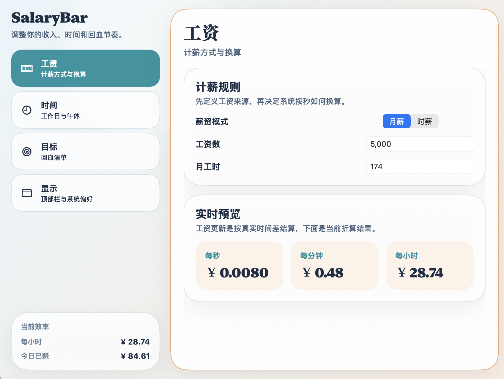

# SalaryBar 产品介绍与使用说明

`SalaryBar` 是一款常驻在 macOS 顶部菜单栏的工资可视化应用。

它把原本按月或按小时结算的收入，转换成你在当天工作过程中可以实时感知的数字反馈。你不需要等到发薪日才知道“今天这班值多少钱”，只要打开电脑，就能在菜单栏看到今天已经赚了多少、还剩多少潜力、当前在为哪个目标努力。

这不是记账软件，也不是考勤系统。`SalaryBar` 更像是一个把工作时间、收入节奏和小目标结合起来的轻量型效率陪伴工具。它通过更直观的方式，让抽象工资变成可感知、可追踪、可自我激励的过程。

---

## 1. 产品概览

### 1.1 一句话介绍

`SalaryBar` 用实时累计的方式，把“上班”翻译成一条看得见的回血进度。

### 1.2 产品核心价值

`SalaryBar` 的核心不是单纯显示工资，而是帮助你重新理解工作反馈：

- 把月薪或时薪转成实时数字，降低收入感知的滞后性。
- 把一天的工作拆成更容易理解的节奏阶段，增强掌控感。
- 把收入映射成具体小目标，让过程比纯数字更有意义。
- 让你在菜单栏就能快速判断“现在是否值得继续投入时间”。

### 1.3 产品定位

`SalaryBar` 适合想更直观感受工作产出的人，但它并不试图取代以下类型工具：

- 它不是财务管理软件，不负责做完整收支统计。
- 它不是复杂的工时系统，不负责团队协作或打卡管理。
- 它不是项目管理平台，不负责任务排期和进度协同。

它解决的是一个更具体的问题：让你在日常工作中，随时知道自己的时间正在转化成多少实际收益。

---

## 2. 适合谁使用

`SalaryBar` 适合以下几类用户：

- 使用 `macOS` 办公，希望菜单栏里有一个轻量、即时的收入反馈工具的人。
- 有固定工作时间的月薪用户，希望把月收入拆解为当天、每小时、每分钟、每秒收益的人。
- 采用时薪结算的兼职、自由职业或灵活工时用户，希望按工作时段追踪当天累计收入的人。
- 容易在工作后半段疲劳、分神，想通过目标和节奏反馈提升持续性的用户。
- 想减少“今天忙了一整天，但没什么实感”这类心理落差的用户。

如果你更在意过程中的即时感受，而不是月底统一结算后的结果，这个产品会更有价值。

---

## 3. 使用场景

### 3.1 日常上班场景

你在正常工作日开启电脑后，`SalaryBar` 会根据你配置的工作时间自动累计当天收入。你不需要额外打开窗口，菜单栏就会持续显示今日已赚金额。

适合这样的时刻：

- 上午刚开工时，用它建立“已经开始产生收益”的正反馈。
- 下午容易疲惫时，用它判断今天还剩多少潜在收益。
- 临近下班时，用它快速判断是否值得再完成一个任务收尾。

### 3.2 按时薪工作的场景

如果你的收入本来就是按小时计算，`SalaryBar` 可以直接换算为每秒、每分钟、每小时的即时收益，让工作结果更加具体。

### 3.3 对抗“工作无感”的场景

很多人并不是不努力，而是很难在工作过程中及时获得反馈。`SalaryBar` 通过实时数字、节奏状态和目标解锁，把原本延迟的收入感知前置到当下，降低机械工作带来的疲劳感。

---

## 4. 产品的主要能力

### 4.1 菜单栏实时显示今日收入

这是 `SalaryBar` 最核心的能力。

应用会常驻在 macOS 顶部菜单栏，并持续显示当天已经累计的收入。你不需要切换窗口，也不需要打开复杂界面，就能在最短路径里获得当前反馈。

它支持多种菜单栏展示方式：

- 仅显示金额，适合希望界面尽量简洁的人。
- 图标加金额，适合希望更有动感和识别度的人。
- 显示状态文案，适合更关注当前状态而不是金额的人。

### 4.2 按秒累计，收入过程可见

`SalaryBar` 会根据你的薪资方式和工作时间，持续换算出以下实时数据：

- 每秒收益
- 每分钟收益
- 每小时收益
- 今日已赚

这让收入不再是一个月底才出现的结果，而是一个你在工作过程中能持续感受到的变化。

### 4.3 支持月薪和时薪两种方式

为了适应不同工作类型，产品支持两种基础计薪方式：

- 月薪模式：适合固定薪资用户，通过月工资和月工时换算实时收益。
- 时薪模式：适合兼职、外包、小时工等场景，直接按时薪计算实时收益。

无论哪种模式，最终都会以统一的实时体验呈现出来。

### 4.4 支持工作日、上下班和午休配置

`SalaryBar` 的累计逻辑不是“全天候无脑加钱”，而是基于你实际设定的工作规则。

你可以配置：

- 哪几天是工作日
- 每天的上班时间
- 每天的下班时间
- 是否启用午休
- 午休开始和结束时间

这意味着金额只会在设定的工作时段内增长，非工作时间和午休时间默认不会累计，更贴近真实工作节奏。

### 4.5 一键切换常见作息预设

如果你不想手动逐项配置，产品也提供常见作息预设，例如：

- 标准 `955`
- 通勤 `965`
- 晚一点 `1075`

通过预设可以快速完成大部分工作时间配置，再按自己的实际情况微调。

### 4.6 支持暂停与继续

工作过程中，总会有临时中断、摸鱼、开小差或真正休息的时候。`SalaryBar` 提供手动暂停能力，用来控制这段时间是否继续计入累计。

当你暂停后：

- 今日已赚会保留
- 累计会暂时停止
- 恢复后会继续接着计算

这让“收入反馈”更接近你对当天实际投入的主观感受。

### 4.7 展示今天还能赚多少

除了“已经赚了多少”，`SalaryBar` 也会告诉你：

- 今天理论上最多能赚到多少
- 今天剩余还能累计多少
- 还有多少工作时间
- 当前工作日程已经推进了多少

这组信息的意义很直接：

它不只是告诉你过去发生了什么，也帮助你判断今天接下来还有没有继续投入的价值。

### 4.8 用目标系统增强动力

很多时候，单纯看一个金额跳动并不能持续激励人。`SalaryBar` 会把收入映射成更具体的“回血目标”，例如一杯咖啡、一顿饭、一本书、一次周末消费，甚至更大的阶段性目标。

系统会根据你的收入水平和当日可达上限，自动匹配更合理的目标层级。收入较低时，目标更偏向高频、轻量的小满足；收入较高时，目标会自然扩展到更高金额的消费或储备型目标。

这种设计的价值在于：

- 降低纯数字带来的疲劳感
- 让工作更容易与具体生活回报建立联系
- 帮助你在一天里获得多次阶段性反馈

### 4.9 目标解锁提醒

当你达到某个目标时，`SalaryBar` 可以触发提醒。你会知道自己已经完成了一个阶段，而不是只有一个模糊的数字变化。

对于需要持续工作专注的人来说，这种小型里程碑反馈通常比单纯盯着金额更有效。

### 4.10 支持个性化显示偏好

为了适应不同审美和菜单栏习惯，产品允许你调整：

- 菜单栏显示样式
- 是否显示图标
- 图标风格
- 金额小数位数
- 货币符号

你可以把它设置得尽量克制，也可以让它更有存在感。

### 4.11 支持开机启动

如果你希望它成为日常工作环境的一部分，可以开启开机启动。这样每次进入桌面后，`SalaryBar` 就会自动在菜单栏开始工作。

---

## 5. 界面说明

### 5.1 菜单栏区域

菜单栏是产品的第一交互入口，也是使用频率最高的部分。

你会在这里看到：

- 今日已赚金额，或当前状态文案
- 可选的小图标
- 非工作时段、暂停中、工作中等状态变化

它的设计重点不是展示尽可能多的信息，而是让你在一眼之内得到最重要的反馈。

### 5.2 主面板

点击菜单栏后，会打开主面板。主面板负责集中展示当天最关键的收入和节奏信息。

在这里你通常能看到：

- 今日已赚的大数字展示
- 当前累计时长
- 每秒、每分钟、每小时收益
- 当前正在冲刺的下一个目标
- 暂停或继续累计的操作按钮
- 打开设置和重置今日的入口

主面板的作用是让你不必进入复杂设置，也能快速读懂今天的整体情况。

### 5.3 今日节奏区域

这一部分会进一步解释你当前所处的工作状态。

它会结合你的工作时段，展示类似这样的信息：

- 今日封顶收益
- 今日还可回血金额
- 节奏进度
- 剩余工时
- 日程进度
- 实际回血进度

系统会把当天节奏分为几个更容易理解的阶段：

- 热身区
- 稳定输出
- 冲刺区
- 收尾区

这些名称不是为了制造复杂概念，而是为了让你更自然地理解自己现在适合做什么。

### 5.4 目标与成就区域

这里会展示一组按照金额排序的目标项，并标记：

- 已经解锁的目标
- 当前进行中的目标
- 每个目标对应的金额

当目标一个个被点亮时，工作反馈会比单纯看数字增长更具体。

### 5.5 设置窗口

设置窗口主要分为四个板块：

- 工资
- 时间
- 目标
- 显示

工资页面用于定义你的计薪方式和实时换算基准。

时间页面用于定义工作日、上下班时间和午休规则。

目标页面用于查看系统推荐的回血目标及当前目标层级。

显示页面用于调整菜单栏外观、数字样式、通知和开机启动偏好。

---

## 6. 快速上手

如果你是第一次使用 `SalaryBar`，可以按下面顺序完成配置。

### 6.1 第一步：配置薪资

先选择你的计薪方式：

- 如果你拿固定工资，选择月薪模式。
- 如果你按小时结算，选择时薪模式。

然后填写对应金额。月薪模式下，还需要填写月工时，以便系统换算实时收入。

### 6.2 第二步：配置工作时间

设置你的工作日、上班时间、下班时间，以及是否需要排除午休时段。

如果你的作息接近常见模式，可以直接套用预设，再做微调。

### 6.3 第三步：检查顶部栏显示方式

根据你的偏好选择：

- 只看金额
- 图标加金额
- 看状态文案

同时可以决定是否显示图标、保留几位小数、使用什么货币符号。

### 6.4 第四步：开始使用

配置完成后，只要进入设定的工作时间，菜单栏就会开始显示当天累计收入。你可以在工作过程中随时点开面板查看更完整的信息。

---

## 7. 日常使用方式

`SalaryBar` 最理想的使用方式不是频繁操作，而是作为一个低打扰、持续存在的工作反馈工具。

你可以这样用：

- 早上开工时，确认今天已经开始进入累计状态。
- 上午推进任务时，偶尔看一眼菜单栏，不必专门打开窗口。
- 午休或临时离开工位时，按需要暂停累计。
- 下午容易疲惫时，打开主面板看看还剩多少潜力和当前目标差距。
- 收工前结合“剩余工时”和“今日封顶”判断要不要继续推进最后一项任务。

产品并不要求你高频互动，它更适合作为一种背景反馈机制存在。

---

## 8. 重要规则说明

为了让使用预期更清晰，下面是一些容易理解但很重要的规则。

### 8.1 什么时间会累计

只有在以下条件同时满足时，金额才会继续增长：

- 已完成基础工资配置
- 当前日期是你设定的工作日
- 当前时间处于工作时段内
- 不在午休时段内
- 没有手动暂停

### 8.2 什么情况下金额不会变化

如果你发现数字没有变化，通常是以下原因之一：

- 还没有完成工资配置
- 现在不是工作日
- 现在不在上班时间内
- 当前处于午休时段
- 你已经手动暂停累计

### 8.3 “今日封顶”是什么意思

“今日封顶”表示按照你今天设定的工作安排，在完整工作时段内理论上最多可以累计到的金额。

它不是额外奖金，也不是月收入预测，而是今天这一天在当前规则下的可达上限。

### 8.4 “还可回血”是什么意思

“还可回血”表示从现在开始到今天工作结束前，理论上还剩多少可累计空间。

这个数值能帮助你快速判断：

- 今天是否还有足够产出空间
- 再坚持一段时间是否值得
- 当前距离某个目标还有多大差距

### 8.5 目标为什么会变化

目标是动态匹配的，不是一组永远固定不变的数字。系统会根据你的收入水平和当日理论上限自动调整目标层级，使目标更贴近你的真实工作回报。

---

## 9. 产品优势

相比传统的工资概念展示方式，`SalaryBar` 有几个明显特点：

- 更即时：收入不是月底结果，而是工作过程中的实时反馈。
- 更轻量：入口就在菜单栏，不需要频繁打开大型应用。
- 更有感知：把收入换算成每秒增长和具体目标，更容易产生直觉。
- 更贴合个人节奏：支持工作日、上下班和午休规则配置。
- 更适合长期使用：提供足够信息，但不会把界面做成复杂系统。

---

## 10. 常见问题

### 10.1 这个产品适合什么平台

`SalaryBar` 是一款 `macOS` 菜单栏应用，核心体验围绕顶部菜单栏展开。

### 10.2 它是记账软件吗

不是。它关注的是“当前工作时间转化成了多少收入”，而不是完整的收入支出管理。

### 10.3 它会替我自动统计真实工资发放吗

不会。它展示的是基于你当前配置规则换算出来的实时收入反馈，用于日常感知和自我激励。

### 10.4 我可以完全不看详细界面吗

可以。菜单栏本身就能满足大多数日常查看需求，详细面板更多是为了在你想深入了解当天状态时使用。

### 10.5 它适合高频操作吗

不需要。更推荐把它当作低打扰的状态反馈工具，而不是频繁点击交互的主应用。

### 10.6 数据是否依赖联网

产品的主要体验是围绕本机配置和实时显示展开，重点是稳定、轻量和低打扰。

---

## 11. 总结

`SalaryBar` 做的事情很简单，但很具体。

它不是为了把工作包装得更复杂，而是让你在最容易疲劳、最难获得正反馈的工作日里，随时知道自己的时间到底在换来什么。菜单栏里那一小段不断变化的数字，配合目标和节奏提示，能够把原本抽象、延迟、无感的收入，变成一条清晰可见的回血进度。

如果你希望有一个轻量、直观、不会打扰正常工作的收入反馈工具，`SalaryBar` 的价值就在这里。
